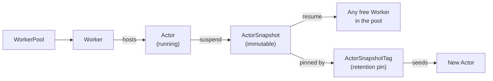

The [kagent architecture]() page established that every AgentInstance runs on an Actor. This page explains what an Actor is built from and what it runs on: the ActorTemplate that it is created from, the compute that hosts it, the sandbox that isolates it, and the snapshot cycle that lets it suspend when idle and resume on demand.

## ActorTemplate

Every Actor is created from an **ActorTemplate**, the compiled definition that the kagent controller produces from a Harness and AgentTemplate pair.

What Substrate adds is enforcement. Substrate rejects any change to an ActorTemplate's spec after it is created, so immutability is a property of the resource itself rather than a convention that the controller follows. That immutability requires the controller to create a new ActorTemplate for every compiled revision instead of editing an existing one, and allows the controller to safely reclaim an old ActorTemplate once no AgentInstance references it.

## Workers and WorkerPools

An Actor needs somewhere to run. Each Actor runs on a **Worker**: a pre-started, sandboxed pod that hosts at most one Actor at a time. Instead of starting a new pod each time an AgentInstance needs an Actor, Substrate schedules that Actor onto a Worker that is already running and waiting.

Workers come from a **WorkerPool**, a Kubernetes custom resource that an operator provisions before any Harness can create AgentInstances. A WorkerPool declares how many Workers to keep running and which sandbox technology those Workers use.

An operator never creates a Worker directly. Substrate manages them, keeping enough ready in each WorkerPool so that an Actor can start or resume on one immediately, without waiting on the Kubernetes scheduler to place a new Pod.

## Sandboxing

Because an Actor often runs a model-directed agent that calls tools and executes commands, Substrate runs each Actor in an isolated sandbox rather than a plain container. A WorkerPool's `sandboxClass` field selects the sandbox technology for its Workers: [gVisor](https://gvisor.dev) or a micro-VM technology such as [Kata Containers](https://katacontainers.io). Both technologies isolate an Actor from its Worker's host kernel, and both support suspend and resume operations.

## Suspend, snapshot, and resume

Substrate's density model rests on one fact about agent workloads: an Actor spends most of its time idle, waiting on a person or a large language model (LLM) to respond, not actively computing. Substrate exploits that by suspending idle Actors and reclaiming their Worker, then resuming them on demand when traffic arrives. Suspending and resuming allows a WorkerPool to run far more Actors than it has Workers for at any given moment.

The following diagram traces an Actor through one suspend-and-resume cycle, and shows the second path that opens up once the resulting snapshot is tagged.

A **WorkerPool** keeps **Workers** running and ready, and one Worker hosts the **Actor** while its conversation is active. Suspending that Actor writes its full state to an immutable **ActorSnapshot** and frees the Worker that it was running on.

The diagram forks at that snapshot, because a snapshot serves two purposes.

- **Resume** restores the same Actor onto **any free Worker in the pool**, which is not necessarily the Worker that it ran on before. Because the snapshot captures the Actor's full state, the conversation continues from where it left off. Every idle agent takes this path.
- An **ActorSnapshotTag** pins that snapshot, and a **New Actor** can be seeded from the tag at the moment that it is created. Resuming an existing Actor never goes through a tag.

A tag gives a snapshot a stable, human-meaningful name, so callers do not need to track Substrate's internal snapshot identity. A tag names one snapshot permanently, and only its visibility scope can change afterward. A tag also acts as a retention pin, so Substrate does not delete a snapshot while a tag still names it.

For example, an agent partway through a long incident investigation reaches a state worth keeping. Creating a [checkpoint]() tags the snapshot that the agent most recently suspended to, which holds that one snapshot in place while the agent carries on and writes newer ones. Without the tag, Substrate collects that snapshot once a newer one supersedes it.

Substrate's own target for this cycle is 100 milliseconds at the ninety-fifth percentile, measured from the moment traffic arrives for a suspended Actor to the moment that Actor can receive it.

## Next steps


  ` title="Your first agent" subtitle="Apply a Harness and AgentTemplate, and talk to the AgentInstance they produce." >}}
  ` title="Substrate operations" subtitle="Size a WorkerPool and choose a sandbox class for your cluster." >}}

