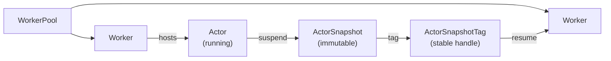

[Architecture]() covers where an Actor fits between an AgentInstance and a running conversation. This page covers how Agent Substrate itself runs that Actor: on what compute, inside what sandbox, and how it suspends and resumes without staying resident the whole time.

## Workers and WorkerPools

A **WorkerPool** is a Kubernetes custom resource that an operator provisions before any Harness can create AgentInstances. It defines a pool of pre-started sandbox pods, called **Workers**, along with the sandbox technology those Workers use.

A Worker is not something an operator creates directly. Substrate manages Workers itself, keeping enough of them ready in each WorkerPool so that an Actor can start or resume on one immediately, without waiting on the Kubernetes scheduler to place a new Pod.

## Sandboxing

Because an Actor often runs a model-directed agent that calls tools and executes commands, Substrate runs each Actor in an isolated sandbox rather than a plain container. A WorkerPool's `sandboxClass` field selects the sandbox technology for its Workers: [gVisor](https://gvisor.dev) or a micro-VM technology such as [Kata Containers](https://katacontainers.io). Both technologies isolate an Actor from its Worker's host kernel, and both support the suspend and resume operations that the rest of this page covers.

## ActorTemplate

An **ActorTemplate** is the compiled, immutable definition that a new Actor is created from. [Architecture]() covers how the kagent controller compiles a Harness and AgentTemplate pair into one. Substrate rejects any change to an ActorTemplate's spec after creation, so the kagent controller creates a new ActorTemplate for every compiled revision rather than editing an existing one, and reclaims old ones once no AgentInstance references them.

## Suspend, snapshot, and resume

Substrate's density model rests on one fact about agent workloads: an Actor spends most of its time idle, waiting on a person or a large language model (LLM) to respond, not actively computing. Substrate exploits that by suspending idle Actors and reclaiming their Worker, then resuming them on demand when traffic arrives. Suspending and resuming this way lets a WorkerPool run far more Actors than it has Workers for at any one moment.

The diagram below follows an Actor through one suspend-and-resume cycle. Read it left to right: a WorkerPool hosts Workers, a Worker hosts a running Actor, suspending that Actor produces a snapshot, and a tag on that snapshot lets a later Actor resume from it on whichever Worker is free.

Suspending an Actor writes its full state to an immutable **ActorSnapshot** and frees the Worker it was running on. An **ActorSnapshotTag** gives that snapshot a stable, human-meaningful name, so callers do not need to track Substrate's internal snapshot identity. A tag's target can be updated to point at a newer snapshot without changing the tag's own name, and a snapshot cannot be deleted while any tag still points to it. Resuming reads the tagged snapshot and restores it onto whichever Worker in the pool is free, not necessarily the Worker the Actor originally ran on.

Substrate's own target for this cycle is 100ms at the 95th percentile, measured from the moment traffic arrives for a suspended Actor to the moment that Actor can receive it.

## Next steps

- [Your first agent](): apply a Harness and AgentTemplate, and watch the Actor they produce suspend and resume.
- [Substrate operations](): size a WorkerPool and choose a sandbox class for your cluster.
