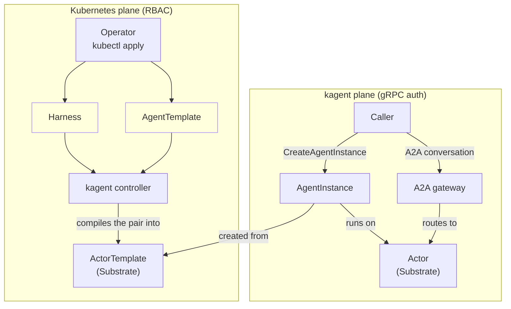

[Core concepts]() defines Harness, AgentTemplate, AgentInstance, and Actor on their own. This page connects them into one system: how applying a Harness and AgentTemplate leads to a running conversation, and which parts of that path Kubernetes governs versus which parts kagent governs itself.

kagent 1.0 splits authorization across two planes, not one:

- The **Kubernetes plane** governs the Harness and AgentTemplate custom resources. Kubernetes Role-Based Access Control (RBAC) decides who can create, read, or edit them, exactly as it would for any other Custom Resource Definition (CRD).
- The **kagent plane** governs AgentInstances: creating one, suspending or resuming it, sharing it, deleting it, and holding a conversation with it. kagent's own gRPC authentication and authorization decide who can do these things, independent of Kubernetes RBAC.

Someone with RBAC access to apply a Harness and AgentTemplate does not automatically get access to create or talk to AgentInstances that use them, and the reverse is also true. The diagram below shows where the boundary between the two planes falls, and the walkthrough after it follows a request across that boundary from start to finish.

Follow the Kubernetes plane first. An operator applies a Harness and an AgentTemplate, governed by Kubernetes RBAC. The kagent controller watches for a valid pair, one whose `allowedAgentTemplates` selector matches, and compiles it into an ActorTemplate on Substrate.

The kagent plane starts once that ActorTemplate exists. A caller, who may or may not be the same person as the operator, calls `CreateAgentInstance` through kagent's gRPC API. This call is governed by kagent's own authentication and authorization, not by Kubernetes RBAC. kagent creates the AgentInstance from the latest compiled ActorTemplate, and that AgentInstance runs on an Actor.

From there, the caller holds a conversation with the AgentInstance over the A2A (Agent-to-Agent) protocol. The A2A gateway routes each request to the Actor running behind the target AgentInstance, so the caller only ever needs to know an AgentInstance's identity, never which Actor or Worker is behind it.

## Why two planes

Kubernetes RBAC is designed to authorize configuration changes: who can create a Deployment, edit a ConfigMap, or in this case, apply a Harness or AgentTemplate. It is not designed to authorize a running conversation, share access to it with another user, or scope who can suspend it. kagent's gRPC plane exists to authorize exactly those actions, at the granularity of a single AgentInstance rather than a namespace or a resource kind.

This split also keeps the two lifecycles independent. Editing a Harness or AgentTemplate does not affect AgentInstances already running against the ActorTemplate they were created from. It only affects new AgentInstances, created after the edit is compiled.

## Next steps


  ` title="Architecture: Agent Substrate" subtitle="See what an Actor actually runs on, and how it suspends and resumes." >}}
  ` title="Your first agent" subtitle="Apply a Harness and AgentTemplate, and talk to the AgentInstance they produce." >}}

