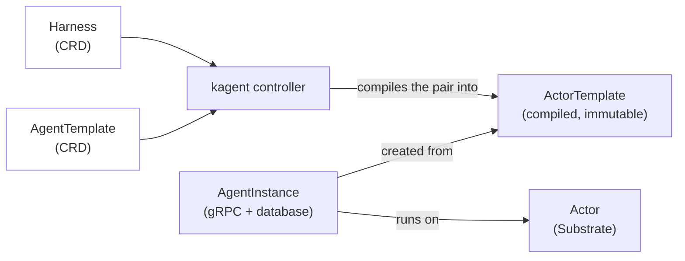

kagent 1.0 replaces the Deployment-based `Agent` custom resource with a new model built around **Harness**, **AgentTemplate**, and **AgentInstance**, running on [Agent Substrate]() instead of plain Kubernetes Deployments. This page defines the vocabulary the rest of these docs use. If your existing kagent installation is on 0.x, see the [0.x docs](). This page and everything under it describes the 1.0 model only.

The new model separates what an agent can do from how it is allowed to run:

- A **Harness** defines how an agent is allowed to run. It picks a runtime and the infrastructure policy around it.
- An **AgentTemplate** defines what an agent can do: its model, prompt, and tools.
- An **AgentInstance** is a running conversation, created by pairing the two.
- An **Actor** is the sandboxed process, provided by Substrate, that an AgentInstance runs on.

The diagram below shows how a Harness and an AgentTemplate become a running conversation. Follow the arrows from left to right: the kagent controller compiles the Harness and AgentTemplate pair into an ActorTemplate, and each AgentInstance is created from that ActorTemplate and runs on an Actor.

The Harness and AgentTemplate are the only two resources an operator applies directly. The kagent controller watches for a valid pair and compiles it into an ActorTemplate. From there, each AgentInstance created from that ActorTemplate gets its own Actor to run on. The rest of this page defines each of these terms in more detail.

## Harness

A **Harness** is a Kubernetes custom resource that defines how an agent is allowed to run. It specifies:

- **Runtime**: the engine that executes the agent. This is either kagent's own Go or Python runtime, or a bring-your-own coding agent such as Claude Code or Codex.
- **Workload**: the container image and environment the runtime runs in.
- **Substrate policy**: the [WorkerPool]() that the Harness's Actors are scheduled onto, and where their snapshots are stored.
- **Allowed AgentTemplates**: a selector that names which AgentTemplates are permitted to run on this Harness.

That last point is a one-way match, not a mutual handshake. An AgentTemplate has no field naming a Harness. Instead, a Harness's `allowedAgentTemplates` selector matches on labels, and any AgentTemplate in the same namespace carrying a matching label becomes eligible to run on it. Whoever controls a Harness's selector decides which AgentTemplates it accepts.

A Harness owns no running compute by itself. Applying one registers a runtime and policy that an AgentTemplate can pair with.

## AgentTemplate

An **AgentTemplate** is a Kubernetes custom resource that defines what an agent does. It specifies:

- **Model configuration**: the large language model (LLM) provider and model the agent uses. This is the only field an AgentTemplate strictly requires.
- **System prompt**: a literal prompt, or a Go-templated one that can `include` shared ConfigMaps.
- **Tools**: a list of tool bindings the agent can call. Each binding is either a Model Context Protocol (MCP) server, or another AgentTemplate used as an agent tool (see [Agent tools](#agent-tools-shared-vs-dedicated) below).
- **Skills** and **plugins**: reusable capability packages, sourced from an Open Container Initiative (OCI) registry, Git, or S3.

An AgentTemplate does nothing on its own. It becomes runnable once it is paired with a Harness whose `allowedAgentTemplates` selector accepts it.

## AgentInstance

An **AgentInstance** is a running, conversational pairing of a Harness and an AgentTemplate. Unlike Harness and AgentTemplate, an AgentInstance is not a Kubernetes custom resource. It does not live in etcd. kagent's own gRPC API creates it, and kagent's PostgreSQL database tracks it.

This split is deliberate, not an implementation detail to work around:

- Applying a Harness or AgentTemplate is a **Kubernetes-native operation**, governed by Kubernetes RBAC, exactly like any other CRD.
- Creating, suspending, resuming, sharing, or deleting an AgentInstance, and holding a conversation with it, are **kagent-native operations**, governed by kagent's own gRPC authentication and authorization, independent of who can `kubectl apply` a Harness or AgentTemplate.

Under the hood, the kagent controller watches for valid Harness and AgentTemplate pairs and compiles each one into an immutable `ActorTemplate`, a Substrate resource keyed by a digest of the compiled revision. Creating an AgentInstance resolves to the latest successfully compiled ActorTemplate for that pair and creates an Actor from it. If you edit the Harness or AgentTemplate, existing AgentInstances keep running against the ActorTemplate they were created from. New AgentInstances pick up the new revision.

Once created, an AgentInstance talks to callers over the A2A (Agent-to-Agent) protocol, through kagent's A2A gateway. The gateway resolves each request to the right AgentInstance and forwards it to the Actor running behind it.

## Actor

An **Actor** is the sandboxed unit of compute, provided by [Agent Substrate](), that runs an AgentInstance's conversation loop. Every AgentInstance is backed by an Actor.

Actors are why AgentInstances can suspend and resume cheaply instead of staying resident: an idle Actor can be snapshotted and torn down, then resumed from that snapshot on demand. [Architecture: Agent Substrate]() covers the full mechanics (Workers, WorkerPools, ActorTemplates, and snapshotting). For this page, an Actor is simply the sandbox that an AgentInstance's conversation runs inside.

## Agent tools: Shared vs. Dedicated

An AgentTemplate's tools are not limited to MCP servers. A tool binding can also point at another AgentTemplate, letting one agent call another agent as a tool. Each agent-tool binding picks an isolation mode:

- **Shared** (the default): the child agent runs inside the same Actor as its parent. This is cheaper, and the child shares its parent's fate. If the parent's Actor is suspended or crashes, so does the child.
- **Dedicated**: the child agent gets its own Actor, isolated from its parent. This is more expensive, but a crash or a long-running task in the child cannot take down the parent, and the child can be scaled, suspended, or resumed independently.

A Shared agent tool can itself have Dedicated agent tools underneath it, but a Shared agent tool cannot contain another Shared one. Sharing a single Actor only ever goes one level deep. Restricting Shared nesting this way keeps the isolation model easy to reason about: at any point in an agent's tool tree, you can tell exactly which Actor a given call executes in just by walking up to the nearest Dedicated boundary, or the root.

## Next steps


  ` title="Architecture" subtitle="See how these pieces fit together end to end, from `kubectl apply` to a live conversation." >}}
  ` title="Architecture: Agent Substrate" subtitle="Learn about Workers, WorkerPools, ActorTemplates, and how Actors suspend and resume." >}}
  ` title="Your first agent" subtitle="Apply a Harness and AgentTemplate, and talk to the AgentInstance they produce." >}}

